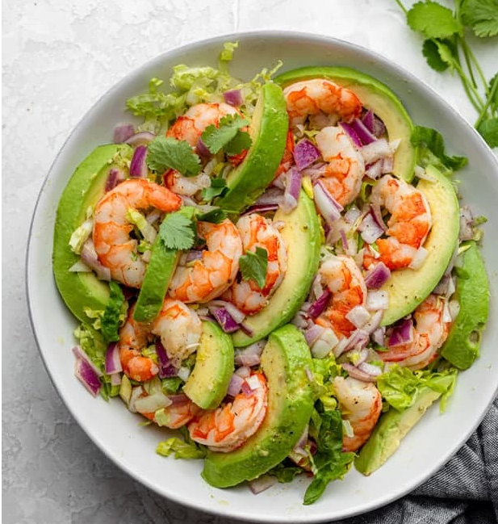

This is a LOCAL change :)
<h1># recipe</h1>
line 2 changed remotely
<h3>This is a short description of the Shrimp Avocado Salad</h3>

This ***low-carb*** Shrimp Avocado Salad is made with only a few simple ingredients with a *zesty lime olive oil dressing* that adds a fresh flavor!
<h3>Ingredients</h3>

-  Shrimp
- Avocado
- Red onions
- Extra virgin olive oil
- Fresh squeezed lime juice
- Some cumin
- Salt and pepper

last line changed locally

This is a REMOTE change :O
